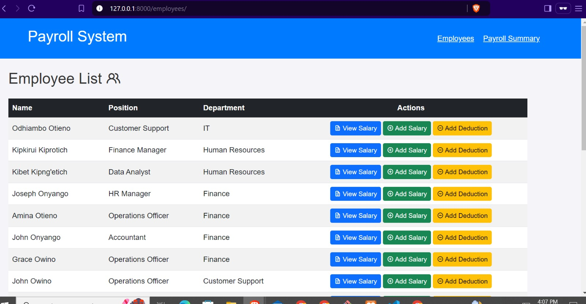

# Payroll System

## Overview

The Payroll System is a web application designed to manage employee salaries, deductions, and other payroll-related functionalities. Built with Django and Bootstrap, it provides a user-friendly interface for HR personnel to efficiently manage employee data and salary information.

## Features

- **Employee Management**: Add, update, and view employee details.
- **Salary Management**: Add salaries, bonuses, allowances, and deductions for each employee.
- **Dashboard**: Overview of total salaries, deductions, net salary, and total number of employees.
- **Responsive Design**: A modern and responsive user interface using Bootstrap 5.
- **Secure**: Utilizes Django's built-in authentication and authorization mechanisms.

## Technologies Used

- **Backend**: Django 5.1.2
- **Frontend**: HTML, CSS, Bootstrap 5
- **Database**: SQLite (or configure for PostgreSQL/MySQL)
- **Python**: 3.12.6

## Installation

### Prerequisites

- Python 3.12 or higher
- Django 5.1.2
- pip

### Step-by-Step Installation

1. **Clone the Repository**:

   ```bash
   git clone https://github.com/ksigei/payroll-system.git
   cd payroll-system
   ```

2. **Create a Virtual Environment** (optional but recommended):

   ```bash
   python -m venv venv
   source venv/bin/activate  # On Windows use: venv\Scripts\activate
   ```

3. **Install Requirements**:

   Install the required Python packages using pip:

   ```bash
   pip install -r requirements.txt
   ```

4. **Migrate the Database**:

   Run the following command to create the necessary database tables:

   ```bash
   python manage.py migrate
   ```

5. **Create a Superuser** (for accessing the admin interface):

   ```bash
   python manage.py createsuperuser
   ```

6. **Run the Development Server**:

   Start the development server:

   ```bash
   python manage.py runserver
   ```

7. **Access the Application**:

   Open your web browser and navigate to `http://127.0.0.1:8000/`.

## Usage

- **Admin Panel**: Access the admin panel by navigating to `http://127.0.0.1:8000/admin/` and log in with the superuser credentials you created. (usernmae: admin, pw: 1234)

- **Dashboard**: View the dashboard for an overview of total salaries, deductions, net salary, and total employees.
- **Employee Management**: Add, update, or remove employee records.
- **Salary Management**: Add salary details, bonuses, and deductions for each employee.

## Screenshots

### Dashboard

*Overview of total salaries, deductions, net salary, and total employees.*

### Employee Management

*Manage employee details including addition, updates, and deletions.*


*Add and manage salaries, bonuses, and deductions for employees.*


## Contributing

Contributions are welcome! If you'd like to contribute to the project, please follow these steps:

1. Fork the repository.
2. Create a new branch (`git checkout -b feature/YourFeature`).
3. Make your changes and commit them (`git commit -m 'Add new feature'`).
4. Push to the branch (`git push origin feature/YourFeature`).
5. Create a new Pull Request.

## License

This project is licensed under the MIT License. See the [LICENSE](LICENSE) file for more details.

## Acknowledgments

- **Django**: The web framework used to build this application.
- **Bootstrap**: For the responsive design and styling components.